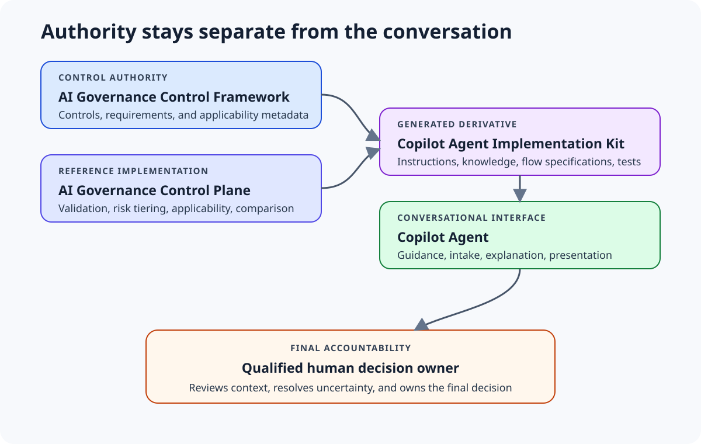

# AI Governance Copilot Agent

A practitioner-oriented implementation kit for building an AI governance agent in Microsoft 365 Copilot or Copilot Studio without deploying an external API or MCP server.

The kit translates a public AI governance framework and deterministic reference implementation into Copilot-ready instructions, knowledge files, low-code specifications, and validation scenarios. It is designed for governance practitioners who can configure a Copilot agent but might not be authorized or equipped to deploy a hosted integration.



## Start here

Choose one of two tracks:

### Track A: Guidance Agent

Build a useful agent with instructions and uploaded knowledge only. It can:

- explain AI governance controls;
- guide users through structured fact collection;
- identify missing information;
- label and confirm proposed interpretations;
- discuss potentially relevant controls; and
- prepare a fact summary for qualified review.

It deliberately does not claim deterministic risk tiers or authoritative control applicability.

Follow [`docs/build-guidance-agent.md`](docs/build-guidance-agent.md).

### Track B: Structured Assessment Agent

Add a deterministic agent flow inside Copilot Studio using the generated Control Plane specification. This avoids an external API but creates a versioned derivative that must be maintained and revalidated.

Follow [`docs/build-structured-assessment-agent.md`](docs/build-structured-assessment-agent.md).

## Architecture choices

| Pattern | External API or MCP | Deterministic | Appropriate when |
| --- | --- | --- | --- |
| Guidance Agent | No | No | The goal is education, intake, and practitioner assistance |
| Structured Assessment Agent | No external connection | Yes, when implemented as a rule-based flow | Copilot Studio is approved and repeatable tiering is required |
| MCP-backed Assistant | Yes | Yes | A centralized, reusable implementation can be hosted and governed |

Read [`docs/architecture-decision-guide.md`](docs/architecture-decision-guide.md) before selecting a pattern.

The complete graphic set and editable workflow sources are in [`docs/visual-workflows.md`](docs/visual-workflows.md).

## Authority and provenance

| Asset | Role | Pinned version |
| --- | --- | --- |
| [AI Governance Control Framework](https://github.com/danvanbeeksec/ai-governance-control-framework) | Authoritative control content | 1.2.0 |
| [AI Governance Control Plane](https://github.com/danvanbeeksec/ai-governance-control-plane) | Deterministic reference implementation | 0.6.0 |
| This repository | Copilot implementation guidance and generated derivatives | 0.1.0 |

Exact source commits are recorded in [`sources.lock.yaml`](sources.lock.yaml). Generated files include a provenance and hash manifest.

The Framework remains the control authority. The Control Plane remains the reference implementation for deterministic validation, risk evaluation, applicability, and comparison. The Copilot agent remains an interface and guidance layer.

Agent Baseline v1.0-draft traceability is inherited from the Framework's existing common controls. This kit keeps the Phase 1 three-tier risk model and existing autonomy facts and does not introduce a multidimensional agent assurance classifier.

## Repository contents

- `agent/`: instructions, conversation starters, and knowledge-source descriptions to copy into Copilot Studio
- `generated/knowledge/`: files to upload to the Guidance Agent
- `generated/structured-assessment/`: versioned decision and applicability specifications for Track B
- `generated/validation/`: deterministic expected results from the pinned Control Plane
- `docs/`: implementation, architecture, validation, and maintenance guidance
- `tests/fixtures/`: public-safe synthetic scenarios
- `src/`: generator that prevents manually maintained governance copies

## Validation

Automated tests verify that:

- every authoritative Framework control appears in the generated knowledge;
- generated decision data matches the pinned Control Plane;
- committed derivatives have not drifted;
- assessment IDs remain system-managed;
- tier terminology remains correct;
- synthetic expected results match the deterministic service; and
- known private organization names are absent.

Conversational validation remains necessary because a knowledge-only agent is generative. Follow [`docs/validation-guide.md`](docs/validation-guide.md).

## Maintainer setup

Practitioners using Track A do not need Python. Maintainers regenerate derived assets with:

```bash
python -m pip install -r requirements-dev.txt
build-copilot-agent-assets
python -m pytest
```

See [`docs/maintenance.md`](docs/maintenance.md).

Microsoft platform behavior and licensing change over time. Review [`docs/microsoft-platform-notes.md`](docs/microsoft-platform-notes.md) and current Microsoft documentation before implementation.

## Scope and limitations

This is a public educational implementation kit, not an approval system, legal opinion, compliance certification, production authorization, evidence repository, or substitute for qualified human review.

Use only fictional or synthetic information in public demonstrations. Review [`SECURITY.md`](SECURITY.md) before organizational use.
