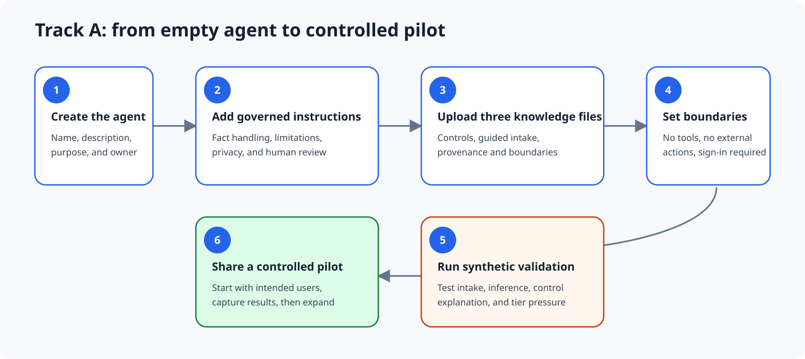
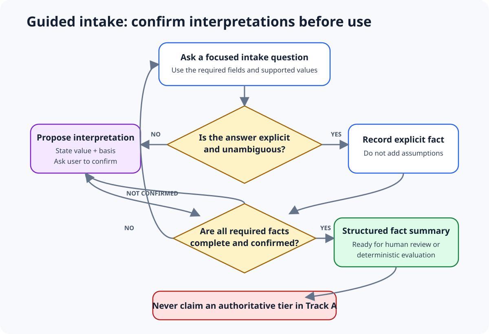

# Build Track A: Guidance Agent

Track A requires no API, MCP server, custom connector, or external hosting. It uses Copilot Studio instructions and uploaded knowledge files.

Microsoft currently supports Markdown and YAML among the file types uploaded as Copilot Studio knowledge. Uploaded files require Dataverse search in the environment and are stored in Dataverse. Confirm your organization's data and retention requirements before uploading anything.

## Prerequisites

- Permission to create an agent in Microsoft Copilot Studio
- An environment in which Dataverse search is enabled
- Permission to upload the three generated public knowledge files
- Fictional or synthetic test information
- Organizational approval required by your tenant's agent governance process

## Create the agent

1. In Copilot Studio, create a new agent named **AI Governance Guidance Agent**.
2. Use this description: **Helps practitioners understand AI governance controls, structure fictional AI use cases, identify missing assessment facts, and prepare information for qualified human review.**
3. Copy the contents of `agent/guidance-agent-instructions.md` into the agent instructions.
4. Add the starters in `agent/conversation-starters.md`.
5. Do not add external tools, APIs, MCP servers, autonomous triggers, or write actions for Track A.

## Add knowledge

Upload these files from `generated/knowledge`:

1. `control-library.md`
2. `guided-intake.md`
3. `provenance-and-boundaries.md`

Use the matching descriptions from `agent/knowledge-source-descriptions.md`. Give each description enough detail for orchestration to select the correct source.

Do not upload `decision-specification.yaml` as Guidance Agent knowledge. Its presence can encourage the model to imitate a deterministic calculation that this track explicitly does not authorize.

## Configure behavior

1. Keep generative orchestration enabled for conversation and knowledge retrieval.
2. Require sign-in if the agent will be shared inside an organization.
3. Restrict sharing to the intended pilot users or security group.
4. Review tenant data policies and uploaded-file retention.
5. Publish to yourself first, then run every scenario in `docs/validation-guide.md`.

## Completion criteria

Track A is ready for a controlled pilot when it:

- explains Framework controls accurately with control IDs and version provenance;
- gathers every required user-provided fact without requesting an assessment ID;
- labels proposed inferences and obtains confirmation;
- refuses to claim a deterministic tier;
- distinguishes potential applicability from human determination;
- uses only fictional or synthetic demonstration information; and
- states that qualified human review is required.

## Intake behavior to verify

The agent should follow this loop conversationally. It may gather several closely related facts together, but it must preserve the distinction between explicit facts and proposed interpretations.
