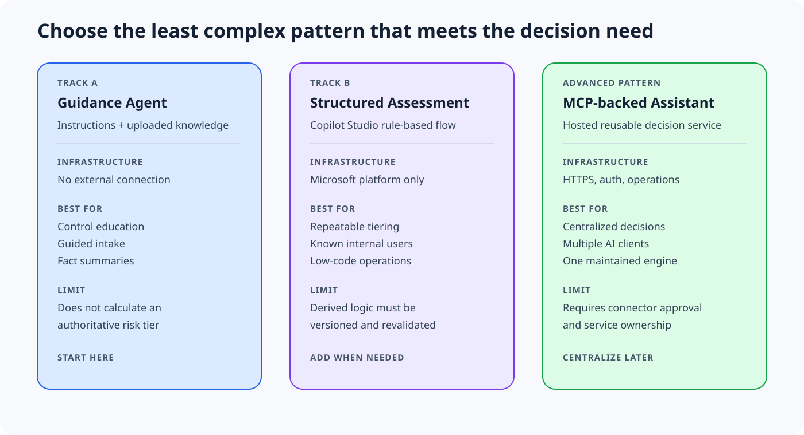

# Visual workflows

These graphics explain the implementation choices and operational boundaries in a format suitable for repository documentation, internal briefings, and practitioner training. Each SVG includes an accessible title and description. Editable Mermaid sources are available under `assets/visuals/source` for adaptation.

## Authority boundaries

Use this graphic to explain why the agent does not become a new source of controls or risk logic. The Framework and Control Plane remain upstream authorities, while the kit and agent translate them into a usable experience.

## Implementation pattern comparison

Use this graphic when selecting an implementation pattern. Track A is the accessible starting point, Track B adds repeatable low-code evaluation, and MCP centralizes the maintained engine when the organization can support the connection.

## Track A build workflow

This sequence complements the detailed build guide. Validation precedes sharing, and the pilot remains intentionally controlled.

## Guided intake loop

Use this workflow to train makers and reviewers on the distinction between an explicit fact and an inferred structured value. Track A ends with a fact summary, not an authoritative tier.

## Reuse guidance

- Use the SVG files directly in GitHub, web documentation, or compatible presentation software.
- Use the Mermaid sources when adapting labels or rebuilding a diagram in another documentation system.
- Preserve the authority labels and Track A tier limitation in derivative materials.
- Do not add employer, client, personal, or other nonpublic examples.
